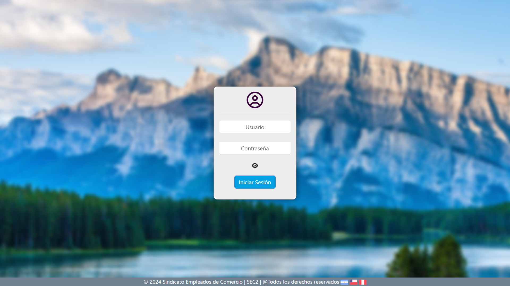
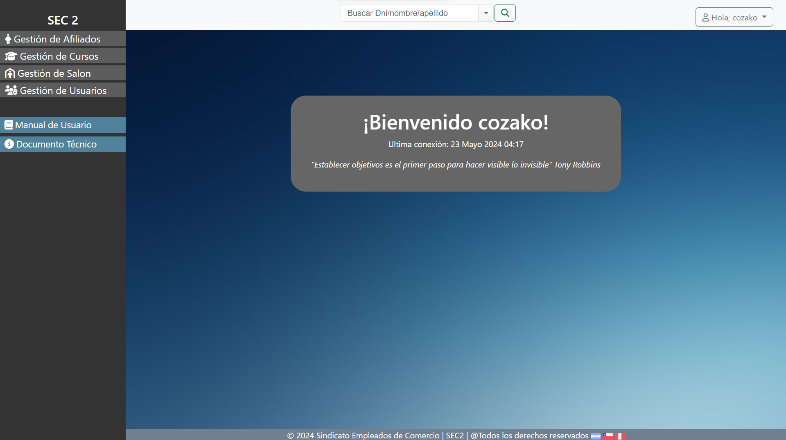

# Sindicato Empleados de Comercio


<div>


<br>
<br>


<br>


<br>
</div>
<br>

## Índice
- [Introducción](#introducción)
- [Autores](#autores)
- [Documentación](#documentación)
- [Elementos](#elementos)
- [Instalación](#instalación)
- [Utilizar base de datos cargada](#utilizar-base-de-datos-cargada)
- [Usuarios creados de la base cargada](#usuarios-creados-de-la-base-cargada)
- [Despedida](#despedida)


# Introducción 
<p align="justify">
El objetivo es desarrollar un sistema que permita la administración de afiliados, cursos y salones de eventos. Para ello, se registran los datos personales de los afiliados, así como también los datos de sus empleadores y los pagos de cuotas afiliatorias; las inscripciones de los alumnos a los distintos cursos y sus respectivos pagos y asistencias; profesores a cargo de los distintos cursos, sus asistencias y pagos; alquileres de salones de eventos a los afiliados, pagos de alquiler y encargados de salones.

El desarrollo de este sistema otorga a los usuarios finales optimización de tiempo en la realización de sus tareas, mejor organización y disponibilidad de información y mayor seguridad para información sensible.
</p>

## Autores

- [Arcos Vargas Martín](https://github.com/cozakoo)
- Fabro Diego Ezequiel
- Lucero Carlos
- Murillo Alexis

## Documentación
- [Documento Técnico](documentacion/documento_tecnico.pdf)
- [Manual de Usuario](documentacion/manual_de_usuario.pdf)

## Elementos
- Python 3.10.7
- Django versión 4.1.1

##### Páginas de ayuda:

<a> https://www.python.org/downloads/ </a>

## Instalación
```bash
#Clonar el repositorio:
git clone https://github.com/UNPSJB/Sec2.git

#Crear el entorno virtual:
python3 -m venv <venv>

#Activar el entorno virtual:
source <venv>/Scripts/activate

#Acceder al proyecto
cd sec2/

#Instalar las dependencias
pip install -r requirements.txt

#Realizar las migraciones
python manage.py makemigrations
python manage.py migrate

#Crear un superusuario
python manage.py createsuperuser

#Ejecutar el proyecto
python manage.py runserver

```
Una vez corriendo el proyecto con el superusuario creado dirigirse a la siguiente url: `http://127.0.0.1:8000/registrar_usuarios/` y crearse un usuario con los permisos necesarios

# Utilizar base de datos cargada
Para utilizar una base de datos pre-cargada, dirígete a la carpeta `backup` y reemplaza el archivo `db.sqlite3` en la carpeta `sec2` con el archivo proporcionado. Esto permitirá que el sistema utilice la base de datos con los datos ya cargados.

Asegúrate de que el servidor de desarrollo esté detenido antes de realizar este cambio para evitar posibles conflictos.

## Usuarios creados de la base cargada
- Username: `admin`         Password: `admin`
- Username: `userAfiliado` 
- Username: `userAlquiler`    
- Username: `userCurso`

Todos los usuarios tienen la misma contraseña: `12345678@`

# Despedida
Gracias por utilizar nuestro sistema de administración. Si tienes alguna pregunta o necesitas asistencia adicional, no dudes en contactarnos. ¡Buena suerte con tu gestión!